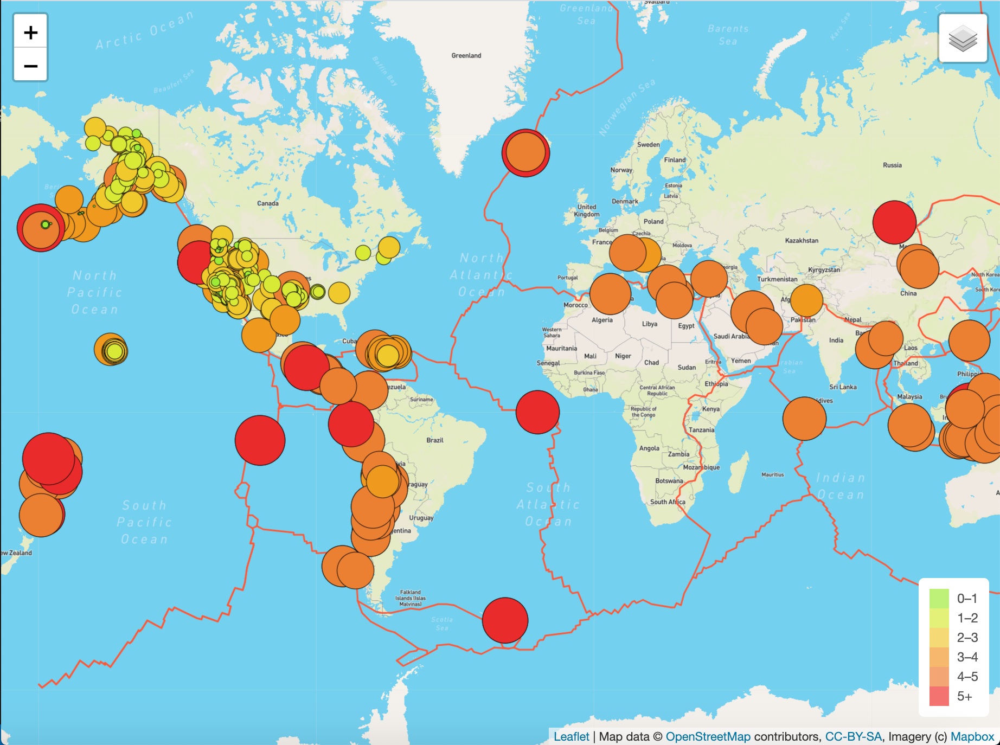
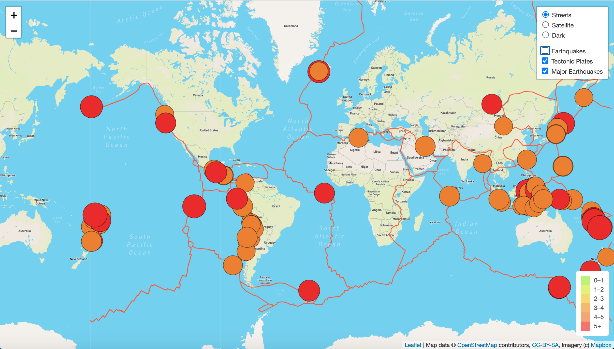
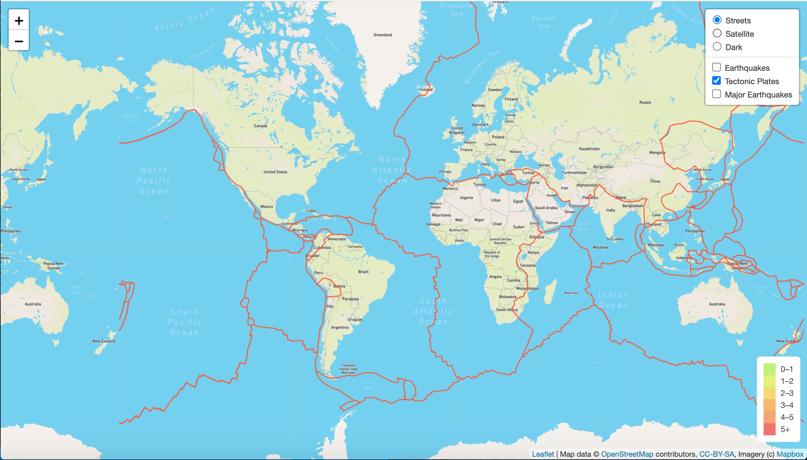
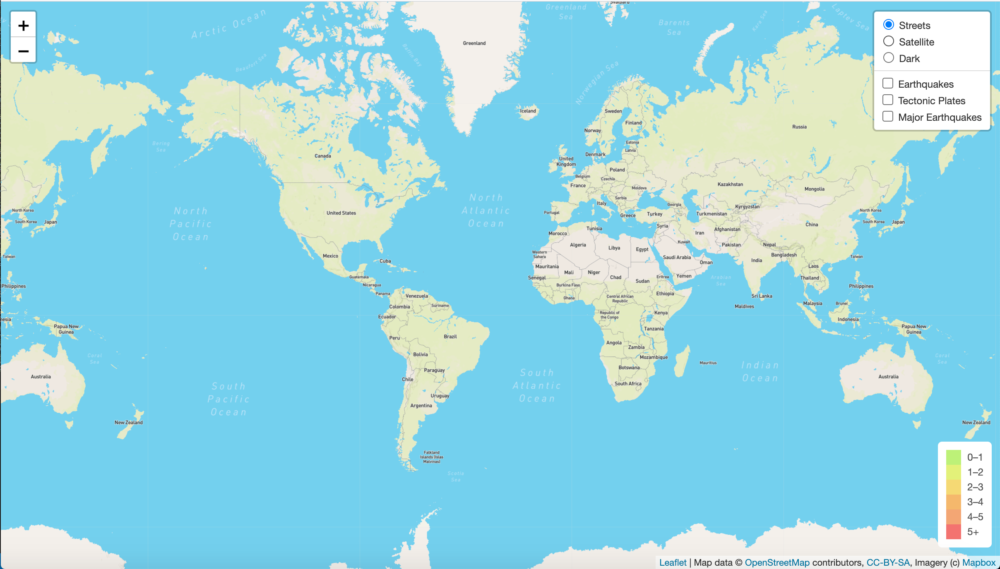
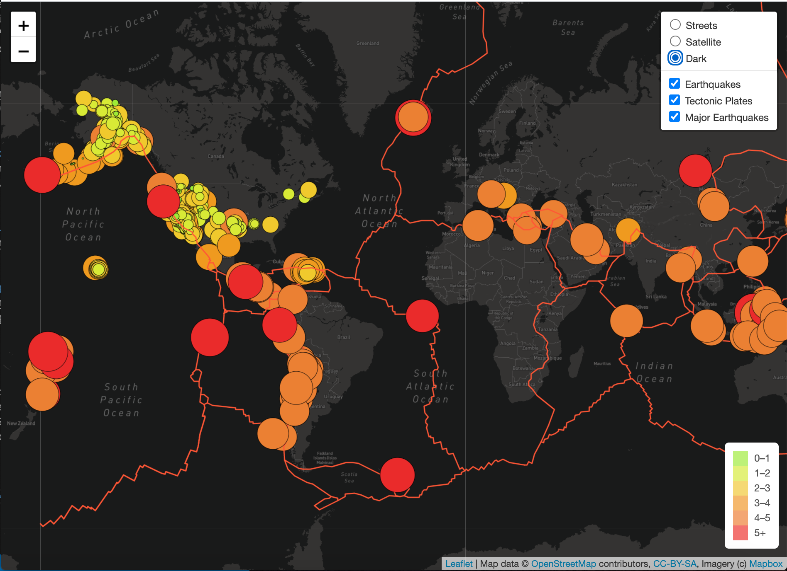
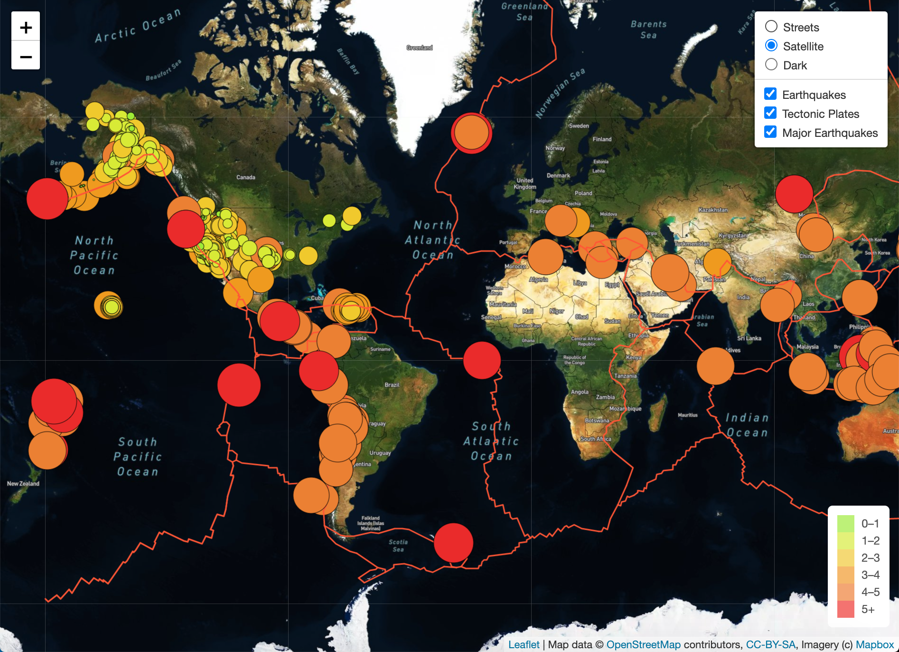

# Mapping_Earthquakes2

## Overview
The goal of this project is to use Mapbox and javascript to visualize USGS earthquake data world-wide. To access the interactive map, download the  Earthquake_Challenge file and launch the index.html page.

## Results
The final result maps all recorded earthquakes from the past seven days. The Mapbox "streets" style and all earthquake data with tectonic plates is loaded as the default. The map will update automatically when new earthquake data is added to the GeoJSON file and the page is refreshed. 

### *Map Overlays*
##### **Major Earthquake Data**
Use the layers menu in the upper righthand corner to toggle the map layers. Select "Earthquakes" to view all earthquakes in the past 7 days, or unselect "Earthquakes" and select "Major Earthquakes" to view only earthquakes of 4.5 magnitude or greater. 

##### **Visualize Tectonic Plates**
You can also toggle the option to visualize tectonic plates by selecting or deselecting "Tectonic Plates"

**Map with Tectonic Plates**

**Map without Tectonic Plates**

### *Map Styles*
The map also provides the option to change the basemap style. The "Streets" style is the default when the page is loaded, but you can also toggle between "Night" and "Satellite" basemaps to get a different visualization. 

**Dark Base Map**

**Satellite Base Map**

## Resources
* [Mapbox](https://www.mapbox.com/)
* [USGS Earthquake Data](https://www.usgs.gov/natural-hazards/earthquake-hazards/earthquakes)
* [Leaflet](https://leafletjs.com/)

